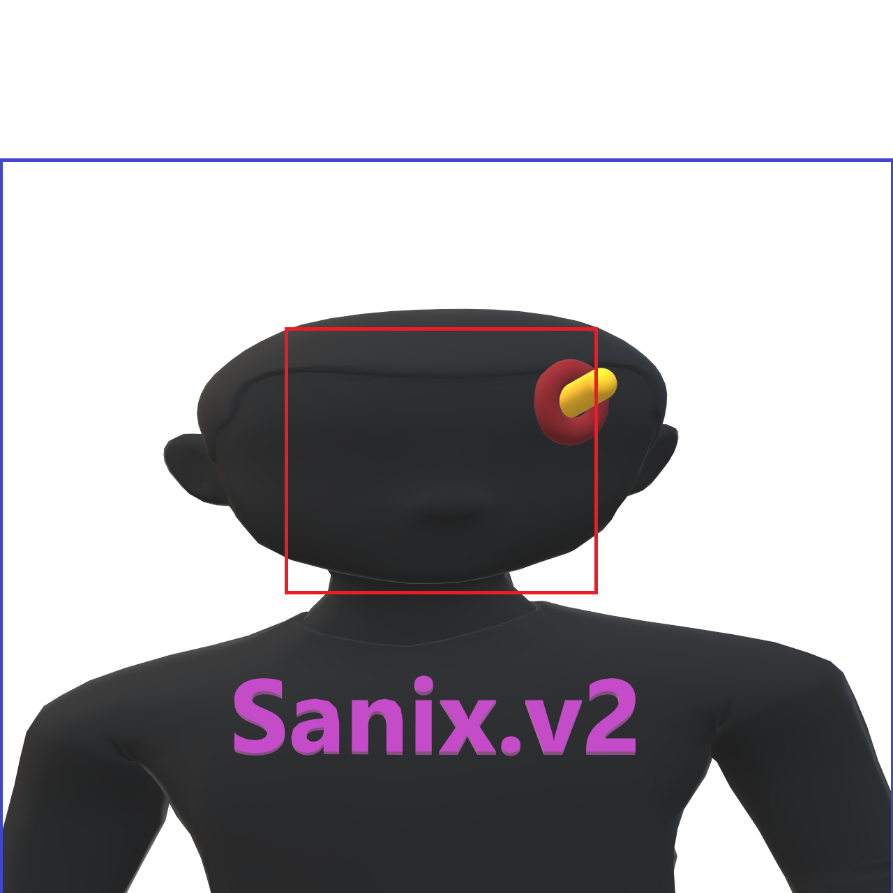

# Sanix.v2
Sanix.v2 BETA VERSION 
<h1 align="center">
   
  Sanix.v2
</h1>

<h4 align="center">
  ⛔ USE AT YOUR OWN RISK ⛔
</h4>

## ❗ Info

Free external cheat for CS2, written in C++.

Discord server: [Sanix.pw and Sanix.v2](https://discord.com/invite/5ph7WrDHqb)

## ⚠️ Notice

***
> I am so busy that I may not update the code on time. If u have the capability to update or fix bugs, u can pull ur request🤩
***
## 📸 Preview

## 📋 Features

Visual

  
- ESP
- Glow
- Radar
- Crosshairs
- No Flash

Misc

- Bhop
- Aimbot
- Triggerbot
- Languages Settings
- Hit Sound
- Bomb Timer

